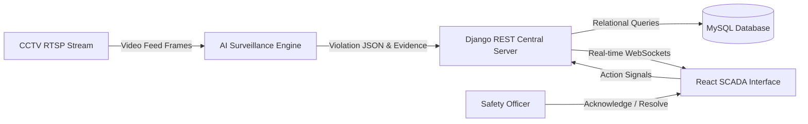
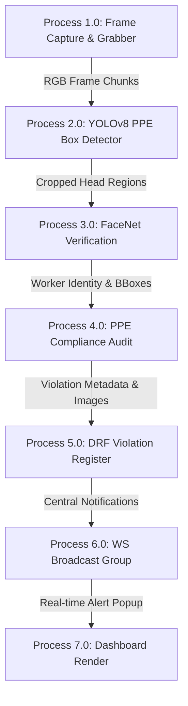
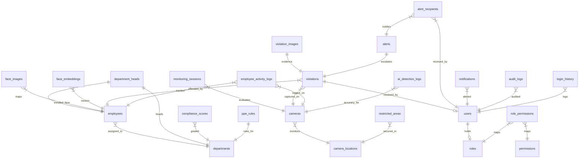

# BSP AI SAFETY SYSTEM: COMPREHENSIVE DOCUMENTATION MANUAL
## Bhilai Steel Plant (BSP), Steel Authority of India Limited (SAIL)

This document contains the complete technical specifications, architectural designs, entity relationships, use cases, and academic thesis blueprints for the Bhilai Steel Plant AI-Based Safety Monitoring & PPE Compliance System.

---

## 1. MCA Final Semester Project Report Index Blueprint

This index is designed to satisfy MCA/MTech academic guidelines for major project thesis submissions:

```
CHAPTER 1: INTRODUCTION
  1.1 Project Overview
  1.2 Objectives and Problem Statement
  1.3 Scope of the System
  1.4 Organization Profile (SAIL & Bhilai Steel Plant)
  1.5 Technology Stack Selection Rationale

CHAPTER 2: SYSTEM ANALYSIS & FEASIBILITY STUDY
  2.1 Existing System Limitations (Manual Inspections)
  2.2 Proposed AI-Driven Automation System
  2.3 Feasibility Study
      2.3.1 Technical Feasibility (GPU & Camera grids)
      2.3.2 Operational Feasibility (Plant personnel safety culture)
      2.3.3 Economic Feasibility (Insurance & Injury cost savings)
  2.4 Hardware & Software Requirement Specifications (SRS)

CHAPTER 3: SYSTEM DESIGN & MODELING
  3.1 Architectural Design (Edge-to-Cloud framework)
  3.2 Use Case Diagrams & Actor Matrix
  3.3 Data Flow Diagrams (Level-0, Level-1, Level-2)
  3.4 Unified Database Schema Design (24 Normal Tables)
  3.5 Entity Relationship (ER) Diagram
  3.6 AI Deep Learning Inference Pipeline Design (YOLOv8 & ArcFace)

CHAPTER 4: DEVELOPMENT METHODOLOGY & SPRINT MAPS
  4.1 Agile Scrum Framework
  4.2 Database Migrations and Seeding
  4.3 Django REST API Implementation Details
  4.4 React SCADA Dashboard UI Component Layouts
  4.5 Computer Vision Threading and Capture Loops

CHAPTER 5: ALGORITHMS & MATHEMATICAL MODELING
  5.1 YOLOv8 Non-Maximum Suppression (NMS) and Box Intersection over Union (IoU)
  5.2 Facial Feature Extraction: ArcFace Cosine Angular Margin Loss
  5.3 Verification Matrix: Cosine Similarity and Cosine Distance Formulas

CHAPTER 6: SYSTEM TESTING & AUDITING
  6.1 Unit Testing (API endpoints & Serializer checks)
  6.2 Integration Testing (AI service posts to REST Backend)
  6.3 Model Inference Evaluation Metrics (mAP50, Precision, Recall, F1)
  6.4 User Acceptance Testing (UAT)

CHAPTER 7: INDUSTRIAL DEPLOYMENT & DEVOPS
  7.1 Production Server Configurations (Nginx, Gunicorn)
  7.2 Database Clustering (MySQL replication)
  7.3 Redis Caching & Celery Background Queue
  7.4 Windows OS Deployment Guide and Camera RTSP Links

CHAPTER 8: SECURITY AUDITING & COMPLIANCE
  8.1 Role-Based Access Control (RBAC) Security Permissions Matrix
  8.2 JWT Token Caching & SSL/TLS Encryption
  8.3 Aadhaar Data Privacy Shield (Optional Fields Masking)

CHAPTER 9: CONCLUSION & FUTURE DEVELOPMENTS
  9.1 Project Outcomes & Accomplishments
  9.2 Limitations of current implementation
  9.3 Future Enhancements (Thermal Camera Heat Exhaustion, Drone feeds)

REFERENCES / BIBLIOGRAPHY
```

---

## 2. System Use Case Matrix

| Actor | Description | System Interfaces | Authorizations |
| :--- | :--- | :--- | :--- |
| **Safety Officer** | Manages plant-wide safety operations | Employees, Violations, Alerts, Reports panels | View, Create, Update, Export, Resolve Violations |
| **Security Personnel** | Handles immediate perimeter intrusions | Live Monitoring screen, Alerts panel | View Live CCTV, Receive Alarm Signals |
| **Department Head** | Reviews specific departmental safety indexes | Analytics, Department Reports, KPIs | View Department Metrics, Export Department scorecards |
| **System Admin** | Administers roles, camera arrays, and parameters | Settings page, Database records, User roles | View, Create, Update, Delete all modules |
| **Management** | Monitors plant-wide historical safety indices | Analytics, Reports panels | View aggregate metrics, export general CSV/PDF |

---

## 3. Data Flow Diagrams (DFDs)

### Level-0 DFD: Context Diagram



### Level-1 DFD: Process Decomposition



---

## 4. Entity Relationship (ER) Diagram

This diagram displays the unified database mapping for our 24 tables.



---

## 5. Heavy Industry Surveillance Deployment Guide

This guide details step-by-step instructions for implementing the system inside a production Windows-based environment (e.g. SAIL server rooms):

### Step 1: Operating System & GPU Configurations
1. **Operating System:** Windows Server 2019/2022 (64-bit).
2. **GPU Driver Setup:** Install the latest **NVIDIA CUDA Toolkit (v12.x)** and matching **cuDNN** libraries to accelerate YOLOv8 model inference.
3. **Python Runtime:** Install Python 3.10+ (ensure PIP is added to PATH).

### Step 2: Database Initialization (MySQL)
1. Install **MySQL Server 8.0** on the central database server.
2. Initialize schema by running:
   ```bash
   mysql -u root -p -e "CREATE DATABASE bsp_safety_db;"
   mysql -u root -p bsp_safety_db < database_schema.sql
   ```

### Step 3: Redis Cache Setup
1. Download and run **Redis for Windows** (v5.0.x or via WSL2).
2. Start the Redis cache daemon:
   ```bash
   redis-server.exe --port 6379
   ```

### Step 4: Setting Up Django REST Server & Celery Workers
1. Navigate to `/backend` and install dependencies:
   ```bash
   pip install -r requirements.txt
   ```
2. Configure settings by editing `bsp_safety_backend/settings.py` to point to production MySQL and set `USE_MYSQL = True`.
3. Run Django migrations:
   ```bash
   python manage.py makemigrations
   python manage.py migrate
   ```
4. Seed the default SAIL records:
   ```bash
   python manage.py seed_bsp_data
   ```
5. Launch the ASGI live web server using Uvicorn (highly recommended for Channels WebSockets):
   ```bash
   uvicorn bsp_safety_backend.asgi:application --host 0.0.0.0 --port 8000 --workers 4
   ```
6. Start Celery worker in a separate command window to compile PDF/Excel reports:
   ```bash
   celery -A bsp_safety_backend worker --loglevel=info
   ```

### Step 5: Setting Up React SCADA Frontend (Nginx for Windows)
1. Build the production React assets inside `/frontend`:
   ```bash
   npm run build
   ```
2. Download Nginx for Windows and configure `/conf/nginx.conf` to serve built HTML/JS assets:
   ```nginx
   server {
       listen       80;
       server_name  bsp-safety.sail-bsp.co.in;

       location / {
           root   C:/Industrial_Safety_SAIL/frontend/dist;
           index  index.html index.htm;
           try_files $uri $uri/ /index.html;
       }

       # Route API requests to Django Backend
       location /api/ {
           proxy_pass http://127.0.0.1:8000/api/;
           proxy_set_header Host $host;
       }

       # Route WebSockets
       location /ws/ {
           proxy_pass http://127.0.0.1:8000/ws/;
           proxy_http_version 1.1;
           proxy_set_header Upgrade $http_upgrade;
           proxy_set_header Connection "Upgrade";
       }
   }
   ```
3. Start Nginx:
   ```bash
   start nginx
   ```

### Step 6: Deploying the AI Inference Stream Daemon
1. Navigate to `/ai_service` on the edge server connected to CCTV cameras.
2. Install GPU-accelerated dependencies:
   ```bash
   pip install ultralytics opencv-python numpy requests
   ```
3. Run the live camera inference thread or the simulator:
   ```bash
   python simulation.py
   ```
This links the edge cameras with the central database and WebSocket channels.
